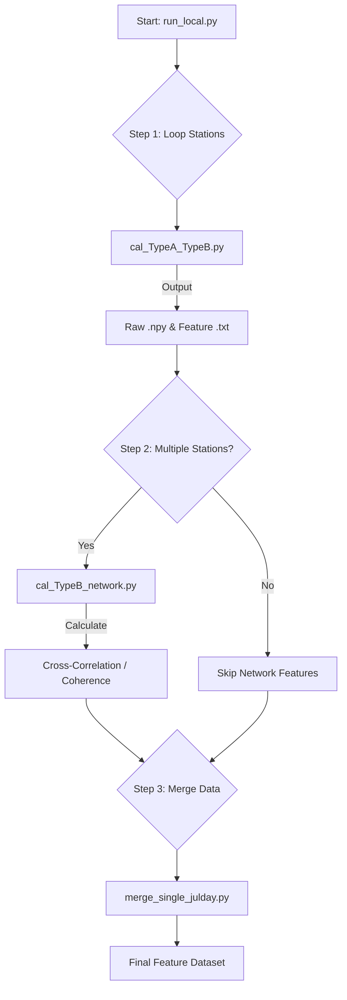

# dataprocess_featurecal

# JJG 地震数据预处理流程说明

本项目包含两步主要的数据预处理流程，旨在将原始的台站数据整理、分量分类，并最终标准化命名为 `Network.Station.Channel.Year.JDay.mseed` 格式。

## 📋 预处理概览

| 阶段 | 脚本文件 | 功能描述 | 输入/输出格式示例 |
| --- | --- | --- | --- |
| **STEP 1** | `SORT.py` | 按台站和分量（Z/N/E）对原始文件进行分类整理 | `Raw.sac` → `Folder/Z/Raw_Z.mseed` |
| **STEP 2** | `featurecal.py` | 格式标准化、Header修正、文件名重构（儒略日） | `Raw_Z.mseed` → `JJG.Station.EHZ.2025.163.mseed` |

---

## 📂 原始数据结构

处理前的原始数据存储在 `E:\JJG_DF_DATA_2025` 目录下，结构如下：

```text
E:\JJG_DF_DATA_2025
├─453007897
├─453008255
├─453014782
...
└─590003009

```

**原始文件命名规则：**
`Station.ID.Year.Month.Day.Hour.Min.Sec.Msec.Comp.sac`

> 示例：`453007897.0001.2025.06.12.00.31.10.000.E.sac`

---

## STEP 1: 数据分量归类 (Sorting)

运行脚本 `SORT.py`。该步骤遍历原始数据，提取 Z、N、E 三个分量，并按台站创建独立的子文件夹进行存储。

### 1. 配置路径

在运行前，请确保 `SORT.py` 中的路径配置正确：

```python
# SORT.py
source_root = r"E:\JJG_DF_DATA_2025"       # 输入：原始数据路径
target_root = r"E:\JJG_SORTED_DATA_2025_SORT" # 输出：分类后的临时路径

```

### 2. 运行脚本

```bash
python SORT.py

```

### 3. 处理结果

脚本将在 `target_root` 下生成按 `台站 -> 分量` 组织的目录结构。

---

## STEP 2: 标准化命名与格式转换 (Normalization)

运行脚本 `featurecal.py`。该步骤读取 STEP 1 生成的数据，执行以下操作：

1. **Header 修正**：写入 Network (`JJG`)，修正 Station 名，映射 Channel 名（Z→EHZ, N→EHN, E→EHE/EHN）。
2. **时间转换**：将日期转换为儒略日（Julian Day）。
3. **格式统一**：合并 Trace 并保存为 MSEED 格式。
4. **严格重命名**：生成最终的标准文件名。

### 1. 配置路径

请确保 `featurecal.py` 中的路径指向 STEP 1 的输出目录：

```python
# featurecal.py
SOURCE_DIR = r"E:\JJG_SORTED_DATA_2025_SORT"       # 输入：上一步的输出
TARGET_DIR = r"E:\JJG_SORTED_DATA_2025_NORMALIZED" # 输出：最终数据路径

```

### 2. 运行脚本

```bash
python featurecal.py

```

### 3. 最终命名规则

文件将被重命名为以下格式：
`Network.Station.Channel.Year.JDay.mseed`

> **示例转换：**
> * 原文件：`453007897...E.sac`
> * 新文件：`JJG.453007897.EHZ.2025.163.mseed`
> * `JJG`: Network 代码
> * `453007897`: Station 名称
> * `EHZ`: Channel (由原始 Z 分量映射)
> * `2025`: 年份
> * `163`: 儒略日 (Julian Day)
> 
> 
> 
> 

---

## ✅ 最终目录结构

完成 STEP 1 和 STEP 2 后，目标文件夹 (`TARGET_DIR`) 将呈现如下结构（注：如果需要 `Asia/Jiangjiagou/2025` 层级，请在设置 TARGET_DIR 时指定或手动移动）：

```text
E:\JJG_SORTED_DATA_2025_NORMALIZED
└─Asia
  └─Jiangjiagou
      └─2025
          ├─453007897
          │  ├─EHZ  (存放 JJG.453007897.EHZ.2025.xxx.mseed)
          │  ├─N    (存放 JJG.453007897.EHN.2025.xxx.mseed)
          │  └─E    (存放 JJG.453007897.EHE.2025.xxx.mseed)
          ├─453008255
          │  ├─EHZ
          │  ├─N
          │  └─E
          ├─453014782
          │  ├─EHZ
          │  ├─N
          │  └─E
          ...
          └─590003009
              ├─EHZ
              ├─N
              └─E

```
这是 **STEP 3** 的说明文档。这一步旨在将前两步处理好的“标准化数据”路径，正确配置到项目的配置文件 `data_path.yaml` 中，以便后续分析程序能够读取到数据。


---

## STEP 3: 配置数据索引路径 (Configuration)

最后一步是将 **STEP 2** 生成的标准化数据目录（`TARGET_DIR`）更新到项目的配置文件 `data_path.yaml` 中。

### 1. 修改配置文件

打开 `data_path.yaml` 文件，找到 `"glic_sac_dir"` 字段。

### 2. 更新路径

将该字段的值修改为 **STEP 2** 中设置的输出路径 (`E:\JJG_SORTED_DATA_2025_NORMALIZED`)。

**⚠️ 注意事项：**

* 请确保路径与实际文件夹完全一致。
* 建议在 Windows 系统中也使用正斜杠 `/` (例如 `E:/...`) 以避免转义字符错误。

```yaml
# data_path.yaml

# ... (前置元数据信息)

# -----------------------------------------------------------
# [关键修改] 将此处路径指向 STEP 2 生成的 NORMALIZED 文件夹
# -----------------------------------------------------------
"glic_sac_dir": "E:/JJG_SORTED_DATA_2025_NORMALIZED"

# 其他配置保持默认或根据需要修改
seismic_feature_dir:  "E:/DF_seismic_model/CN_paper/Flow-Alert-main/jjg"
event_catalog_version: "Flow_Bench_Catalog_work_v0dot8-10.txt"

```

---

### ✅ 预处理流程总结

至此，数据预处理工作全部完成。您的数据流向如下：

1. **原始数据** (`JJG_DF_DATA_2025`)
* ⬇️ *STEP 1 (Sorting)*


2. **分类数据** (`JJG_SORTED_DATA_2025_SORT`)
* ⬇️ *STEP 2 (Normalization)*


3. **标准数据** (`JJG_SORTED_DATA_2025_NORMALIZED`)
* ⬇️ *STEP 3 (Configuration)*


4. **分析程序** (通过 `data_path.yaml` 读取数据)


## STEP 4: 特征计算与提取 (Feature Extraction)

运行主控脚本 `run_local.py`。该脚本作为一个调度器（Orchestrator），按顺序调用底层算法模块，计算单台站物理特征（Type A）、单台站统计特征（Type B）以及多台站网络特征（Network Features）。

### 1. 核心逻辑详解

该流程包含三个顺序执行的子模块：

#### 🔹 Sub-step 1: 单台站特征计算 (`cal_TypeA_TypeB.py`)

该模块遍历 `station_list` 中的每一个台站，对每一天的波形数据进行滑窗处理（默认 60秒）。

* **输入**：STEP 2 生成的标准化 MSEED/SAC 数据。
* **计算内容**：
* **Type A Features (物理特征)**：调用 `cal_attributes_A`。主要关注信号的物理边界，将速度转换为位移/加速度相关的物理量（nm/s），并进行振幅截断（Clipping）以去除极端异常值。包含约 17 个特征。
* **Type B Features (统计/谱特征)**：调用 `cal_attributes_B`。基于 Random Forest 筛选出的关键特征，包含时域统计量（如 RMS, Kurtosis, Skewness）和频域特征（如 MeanFFT, PeakFFT）。包含约 59 个特征。


* **输出**：生成中间态的 `.npy` 数据切片和 `.txt` 特征文件。

#### 🔹 Sub-step 2: 网络特征计算 (`cal_TypeB_network.py`)

当配置的台站数量大于 1 时，该模块会被激活。它利用台站间的协同性来区分局部噪声和区域性事件。

* **逻辑**：
* 读取 Sub-step 1 生成的切片数据。
* **RMS/IQR 比率**：计算整个台网中振幅最大与最小台站的比值，衡量能量分布的不均匀性。
* **相关性分析 (Coherence & Cross-Correlation)**：使用 `itertools.combinations` 生成所有可能的台站对，计算两两之间的波形相似度（Wasserstein Distance）、滞后时间（Lag Time）和最大相干性（Max Coherence）。


* **目的**：泥石流信号通常在多个台站上具有特定的时空相关性，而局部噪声通常是不相关的。

#### 🔹 Sub-step 3: 数据合并 (`merge_single_julday.py`)

* **逻辑**：将分散在各个时间窗和临时文件夹中的 Type A、Type B 和 Network 特征文件合并为单一的 CSV 或 TXT 数据集。
* **清理**：合并完成后，清理中间产生的临时缓存文件。

---

### 2. 配置运行参数

打开 `run_local.py`，根据实际情况修改配置区域：

```python
# run_local.py

# ================= 配置区域 =================
catchment_name = "Jiangjiagou" # 流域名称
seismic_network = "JJG"        # 台网代码
input_year = 2025              # 处理年份

# 台站列表：必须与文件夹名称完全一致
station_list = ["453007897", "453008255", "453014782", ...] 

input_component = "EHZ"        # 计算分量 (通常使用垂直分量)
input_window_size = 60         # 滑窗大小 (秒)

# 时间范围 (儒略日 Julian Day)
start_julday = 210             # 开始日期
end_julday = 210               # 结束日期 (可相同以运行单天)
# ===========================================

```

### 3. 运行脚本

在终端中执行：

```bash
python run_local.py

```

### 4. 运行状态监控

脚本运行时会输出详细的日志，帮助您监控进度：

* `[Step 1]` 阶段会显示当前正在处理的 Station 和 JulDay。
* `[Step 2]` 阶段会显示网络特征的计算进度（若台站数 < 2 则自动跳过）。
* `[Step 3]` 阶段显示最终文件的合并状态。

> **⚠️ 注意：**
> 如果遇到 `ImportError`，请确保文件夹中包含 `cal_TypeA_TypeB.py`, `cal_TypeB_network.py` 和 `merge_single_julday.py`，且文件名无误。

---

### 📊 处理流程图


